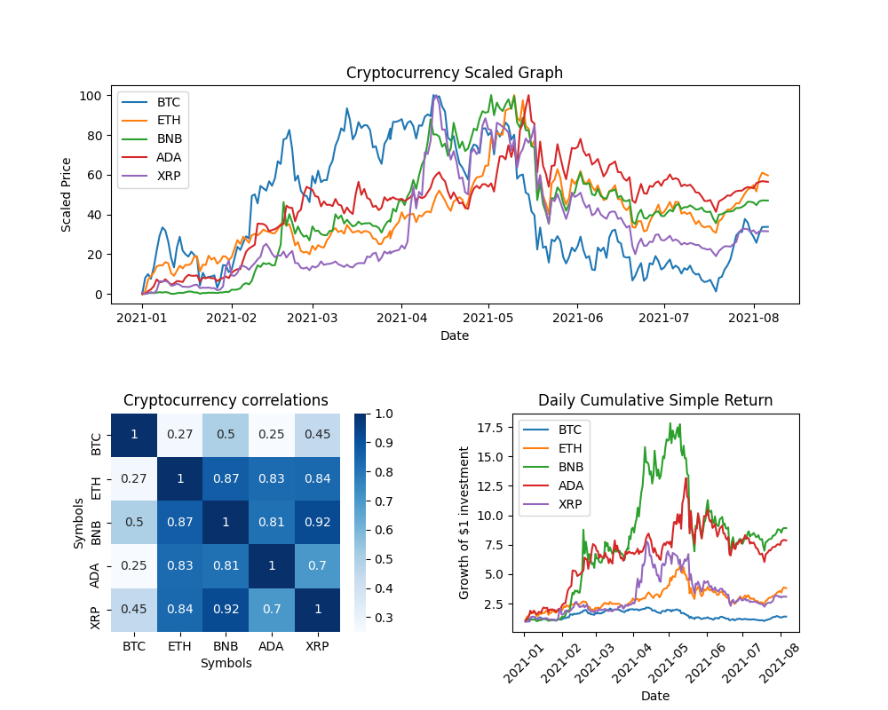
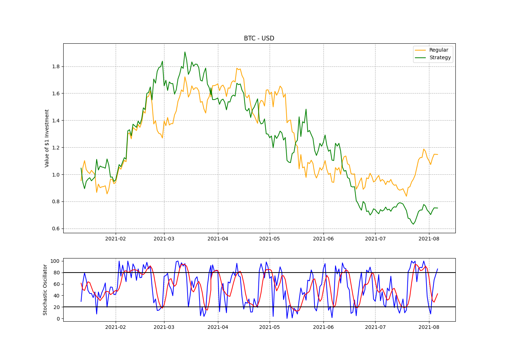
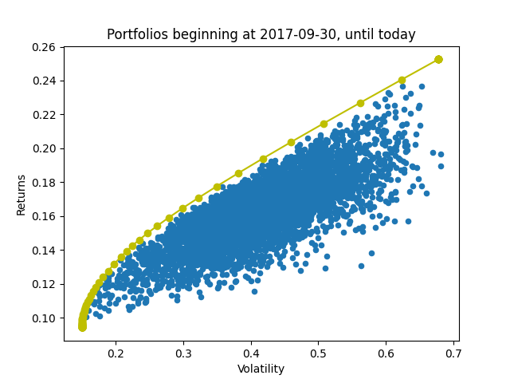
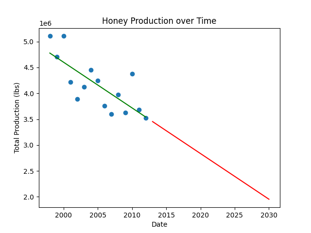

Thank you for taking a look at my portfolio!

I am a python programmer interested in finance and crypto. 

At the moment, my portfolio contains six projects. four data analysis projects, and two simple bitcoin trading bots.
I am currently learning more about algorithmic trading, and will tackle machine learning after that. I will continue to add to this portfolio as time goes on.

Thank you for you time, and please don't hesitate to get in touch if you have any questions!

Johnny

duffy.johnny@gmail.com

# [Algorithimic Trader: Moving Average Crossover Strategy](https://github.com/JohnnyDuffy/Portfolio/blob/main/AlgoTrader-MovingAverageCrossoverStrategy.py)
* Retreives live price data for bitcoin
* Calculates moving averages of Adjusted Close
* Generates buy signal if short term average is above long term average

# [Crypto Market Analysis](https://github.com/JohnnyDuffy/Portfolio/blob/main/CryptoMarketAnalysis.py)
* Retreives live data for any user specified crypto assets
* Scales price data, and calculates correlation and cumulative returns of each asset. 
* The cumulative returns plot can be swapped out to a bar chart

# [Algorithmic Trader: Stochastic Oscillator and SAR](https://github.com/JohnnyDuffy/Portfolio/blob/main/AlgoTrader-StochasticAndSAR.py)
* Retreives live price data for bitcoin
* Uses TA-lib to calculate Stochastic Oscillator and Parabolic SAR indicators
* Generates buy and sell signals
* Calculates returns

# [Portfolio Optimisation](https://github.com/JohnnyDuffy/Portfolio/blob/main/PortfolioOptimiser.py)
* Retreives data for a user specified portfolio of stocks and crypto assets
* Calculates returns and covariance
* Generates 5000 portfolios and calculates optimum weighting

# [Regression: Analysing Honey Production Over Time](https://github.com/JohnnyDuffy/Portfolio/blob/main/Regression.py)
* Extracts and reorganises data
* Generates linear regression model using sklearn
* Identifies trend direction by plotting line of best fit
* Extrapolates data into the future

